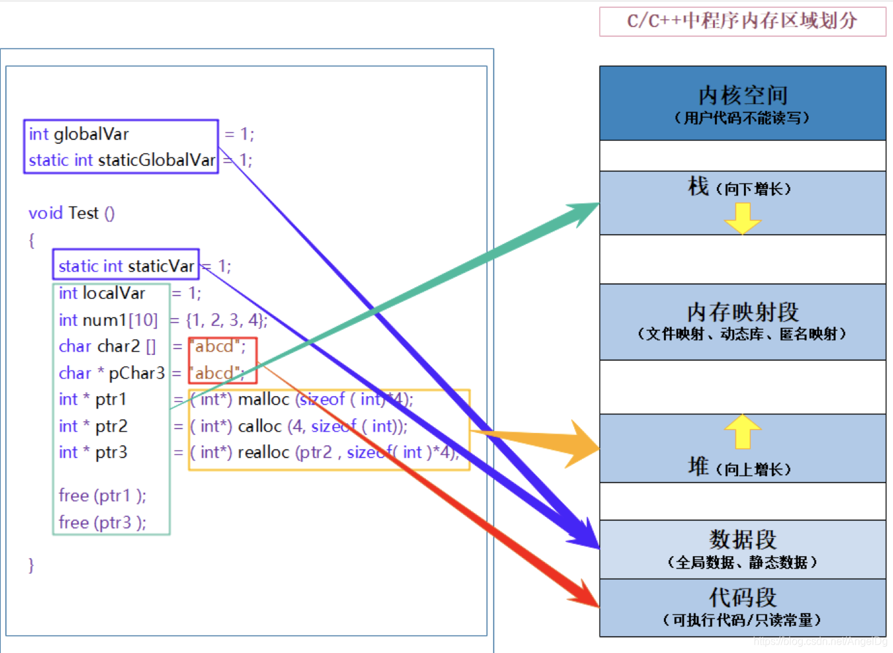

# Beginner of cpp

- [Beginner of cpp](#beginner-of-cpp)
  - [编译与运行](#编译与运行)
  - [c++基础](#c基础)
    - [namespace](#namespace)
    - [namespace定义](#namespace定义)
    - [namespace使用](#namespace使用)
    - [标准输入输出](#标准输入输出)
    - [缺省参数](#缺省参数)
      - [全缺省](#全缺省)
      - [半缺省](#半缺省)
    - [函数重载](#函数重载)
      - [函数重载原理](#函数重载原理)
      - [extern "C"](#extern-c)
    - [指针](#指针)
    - [const和static的区别](#const和static的区别)
    - [引用](#引用)
      - [引用的特性](#引用的特性)
      - [常引用](#常引用)
      - [引用的使用场景](#引用的使用场景)
      - [指针和引用的区别](#指针和引用的区别)
    - [内联函数](#内联函数)
      - [内联函数设计的目的](#内联函数设计的目的)
      - [内联函数的缺点](#内联函数的缺点)
      - [内联函数的使用](#内联函数的使用)
  - [面向对象](#面向对象)
    - [类的定义](#类的定义)
    - [类的访问限定符](#类的访问限定符)
    - [类的作用域](#类的作用域)
    - [类的实例化与对象](#类的实例化与对象)
    - [类的对象模型](#类的对象模型)
      - [类对象的存储方式](#类对象的存储方式)
      - [类对象的大小](#类对象的大小)
    - [this指针](#this指针)
      - [this指针特性](#this指针特性)
    - [类的六个默认的成员函数](#类的六个默认的成员函数)
      - [构造函数](#构造函数)
      - [析构函数](#析构函数)
      - [拷贝构造函数](#拷贝构造函数)
      - [赋值运算符=](#赋值运算符)
      - [取地址重载](#取地址重载)
      - [const取地址重载](#const取地址重载)
    - [初始化列表](#初始化列表)
    - [静态成员static](#静态成员static)
      - [访问方式](#访问方式)
    - [友元](#友元)
      - [友元函数](#友元函数)
      - [友元类](#友元类)
      - [友元类使用场景](#友元类使用场景)
    - [内部类](#内部类)
  - [C/C++内存管理](#cc内存管理)
    - [内存区域说明](#内存区域说明)
    - [new和delete](#new和delete)
      - [操作内置类型](#操作内置类型)
      - [操作自定义类型](#操作自定义类型)
    - [operator new和operator delete](#operator-new和operator-delete)
      - [malloc/free和new/delete的区别](#mallocfree和newdelete的区别)
    - [内存泄漏](#内存泄漏)
      - [危害](#危害)
      - [分类](#分类)
      - [如何避免内存泄漏](#如何避免内存泄漏)
      - [*如何一次在堆上申请4G的内存*](#如何一次在堆上申请4g的内存)
  - [模板（template）](#模板template)
    - [泛型编程](#泛型编程)
    - [函数模板](#函数模板)
      - [函数模板原理](#函数模板原理)
      - [函数模板实例化](#函数模板实例化)
      - [函数模板的匹配原则](#函数模板的匹配原则)
    - [类模板](#类模板)
      - [类模板与继承](#类模板与继承)
    - [模板的优缺点](#模板的优缺点)
  - [I/O流](#io流)
    - [标准I/O流](#标准io流)
    - [文件I/O流](#文件io流)
      - [文件流对象](#文件流对象)
      - [文件打开方式](#文件打开方式)
      - [文件读写操作](#文件读写操作)
      - [关闭文件](#关闭文件)
    - [stringstream](#stringstream)
  - [类的继承](#类的继承)
    - [继承的概念](#继承的概念)
    - [继承的定义](#继承的定义)
      - [继承访问限定符](#继承访问限定符)
    - [基类和派生类之间相互转换](#基类和派生类之间相互转换)
    - [继承的作用域](#继承的作用域)
    - [派生类的默认成员函数](#派生类的默认成员函数)
    - [额外的点](#额外的点)
  - [多态](#多态)
    - [多态定义和实现](#多态定义和实现)
    - [抽象类](#抽象类)
    - [接口继承与实现继承](#接口继承与实现继承)
    - [多态的实现原理](#多态的实现原理)
      - [虚函数表和虚表指针](#虚函数表和虚表指针)
      - [派生类虚函数表生成](#派生类虚函数表生成)
      - [多态原理](#多态原理)
      - [静态绑定和动态绑定](#静态绑定和动态绑定)
      - [多继承中的虚表](#多继承中的虚表)
    - [常见问题](#常见问题)
  - [C++11](#c11)
    - [列表的统一初始化](#列表的统一初始化)
    - [auto](#auto)
    - [nullptr](#nullptr)
    - [explicit](#explicit)
      - [隐式转换](#隐式转换)
    - [左值和右值](#左值和右值)
      - [std::move](#stdmove)
      - [左值引用和右值引用](#左值引用和右值引用)
    - [新增功能](#新增功能)
    - [多线程](#多线程)
      - [线程库](#线程库)
      - [互斥量库](#互斥量库)
      - [原子操作库](#原子操作库)
      - [条件变量库](#条件变量库)
  - [单元测试-googletest](#单元测试-googletest)
    - [SetUp and TearDown函数](#setup-and-teardown函数)
    - [测试用例宏](#测试用例宏)


## 编译与运行
需要安装好gcc/g++编译环境
* 在项目的根目录下创建文件夹`build`并进入此文件夹`cd build`
* 执行cmake命令生成编译Makfile文件：`cmake .`
* 执行make命令进行编译，得到可执行的二进制文件demo：`make`

## c++基础

### namespace
一个命名空间定义了一个新的作用域，命名空间内所有的内容都局限于该命名空间

### namespace定义
* namespace 关键字后面跟命名空间名称和大括号
```cpp
namespace MyNamespace {
    void print() {
        std::cout << "print in MyNamespace" << endl;
    }
}
```
* namespace支持嵌套
* 同一个工程中允许存在多个相同名称的命名空间，编译器最后会将其所有成员合在一个命名空间中

### namespace使用
* 命名空间和作用域限定符
```cpp
MyNamespace::print();
```
* 使用using引入命名空间中的成员
```cpp
using MyNamespace::print;
```
* 使用using引入整个命名空间
```cpp
using MyNamespace
```

### 标准输入输出
* std::cin: 标准输入
```cpp
int val;
std::cin >> val;
```
* std::cout: 标准输出
```cpp
std::cout << "Hello cpp" << std::endl;
```
* std::cerr: 标准错误输出
```cpp
std::cerr << "Hello cpp" << std::endl;
```

### 缺省参数
在声明或者定义函数的时候，为函数的参数指定一个默认值，在调用函数的时候，如果没有为该参数传入实参，则采用默认参数，否则采用实参
* 缺省参数不能在声明和定义中同时出现
* 缺省参数值必须是常量或者全局变量
#### 全缺省
函数的全部参数在定义的时候全部设置默认值
```cpp
int default_all_params(int length = 3, int width = 4, int height = 5) {
    std::cout << "length = " << length << ", width = " << width
    << ", height = " << height << std::endl;
    return length * width * height;
}
```

#### 半缺省
* 必须从右到左依次给出，不能间隔
```cpp
int default_partial_params(int length, int width = 4, int height = 5) {
    std::cout << "length = " << length << ", width = " << width
    << ", height = " << height << std::endl;
    return length * width * height;
}
```
### 函数重载
同一个作用域中的两个函数的函数名相同，但是形参列表不同：
* 形参个数不同
* 形参类型不同
* 形参顺序不同

#### 函数重载原理
C++函数再编译后会生成一个标识符，该标识符由函数名称和函数参数类型共同组成，因此即使同名函数，参数不同，修饰出来的标识符可能会不一样，这个就支持了函数重载
例如：
以下两个函数
```cpp
void fun(int a, string b);
void fun(string a, int b);
```
编译出来的函数标识符分别为
```cpp
_fun_int_string
_fun_string_int
```
#### extern "C"
C语言中函数无法重载，因为它不支持函数类似C++的函数标识符的编译机制。在C++中，如果使用`extern "C"`修饰函数，那么函数就无法重载
```cpp
#include <iostream>
using namespace::std

extern "C" void fun()
{
  
}
extern "C" void fun(int a)
{
  
}

int main()
{

}

```
上面的写法编译会报错，提示不允许函数fun的重载


### 指针
指针变量的值是另一块内存空间的起始
* 声明指针
  ```cpp
  int a= 10;
  int *pa = &a;
  ```
* 获取指针值
  ```cpp
  int a= 10;
  int *pa = &a;
  cout << *pa << endl;
  ```
* 双重指针：指向指针的指针
  ```cpp
  int a= 10;
  int *pa = &a;
  int *ppa = &pa;
  cout << **ppa << endl;
  ```
指针可以方便地操作内存，但是容易造成内存泄露的问题，谨慎使用

### const和static的区别
const定义的常量在超出其作用域之后其空间会被释放，而static定义的静态变量是全局的，不会在某个函数执行结束后被释放

### 引用
引用是已存在在内存中的变量的一个别名，编译器不会为引用变量开辟内存空间，它和引用的变量公用同一块内存空间
* const变量只能通过构造函数初始化列表进行
* static变量一般在类的内部声明，类外部定义，定义时不能再添加static关键字
```cpp
class Test {
private:
  const int a; // 只能在构造函数初始化列表中初始化
  static int b; // 在类的实现文件中定义和初始化
  const static int c;
  static const int d;
public: 
  Test() : a(0) {}
  enum {size1 = 100, size2 = 200}
}

int Test::b = 0; // 在类外部定义类的static静态变量
const int Test::c = 0;
const int Test::d = 0;
```

#### 引用的特性
* 引用在定义时必须初始化
* 一个变量可以有多个引用
* 引用一旦绑定了一个实体，就不能再引用其它实体

#### 常引用
常引用是用const修饰的引用，const修饰的实体只能交给const引用
```cpp
int a = 100;
const int &ra = a;

const int ca = 100;
// 常变量不能用普通引用，只能用常引用
// int &rca = ca;
const int &rca = ca;
```
#### 引用的使用场景
* 作为函数参数
* 作为函数的返回值

#### 指针和引用的区别
* 引用比指针更加安全，因为指针可能导致内存泄漏的问题，所以开发中更加推荐使用引用
* 引用需要初始化，指针没有要求
* 引用在引用一个实体之后，不能重新引用其它实体，指针可以在任何时候指向任何一个相同类型的实体
* 不存在NULL引用，但存在NULL指针
* sizeof(引用)：引用类型的大小，sizeof(指针)：指向的地址所占空间的大小，32位下为4字节，64位下为8字节
* 引用自增或自减指的是引用实体的值的自增自减，指针的自增自减指的是地址的自增自减
* 存在多级指针，但没有多级引用
* 访问实体方式不同，引用访问由编译器处理，指针是由开发者显示解引用

### 内联函数
内联函数与普通函数类似，在函数前加上inline就成为内联函数
```cpp
inline void thisIsInlineFunction()
{

}
```
内联函数在编译阶段会把所有调用内联函数的地方替换为函数体
#### 内联函数设计的目的
* 代替部分`#define`宏定义
  
  宏是预处理指令，在预处理的阶段把所有的宏名使用宏体代替，内联函数在编译阶段替换其函数体

  宏的缺点和内联函数的优点
  * 宏没有类型检查，不管对错都直接替换；内联函数在编译时会进行安全检查
  * 宏的编写有限制，比如只能写一行，不能使用流程控制语句，比如return，if else等；内联函数可以使用丰富的流程控制语句
  * 宏无法操作C++类的私有成员
* 提高程序运行效率
  
  普通的函数调用会进行函数的入栈出栈操作，一方面，函数入栈出栈需要消耗大量的时间，函数入栈需要将实参，局部变量以及返回地址等都需要压入栈中，函数执行完成之后需要清理现场；另一方面，程序分配的栈空间是有限的，过多的函数调用可能会导致栈溢出问题
  
  内联函数通过将函数体插入到调用地方，减少了函数的调用次数

#### 内联函数的缺点
内联函数的关键点是替换函数体，这使得重复的代码量会增大，因此尽量保持内联函数的代码行数较少

实际上内联函数只是对编译器在编译过程的建议，具体是否进行内联，需要根据实际情况决定，比较复杂的内联函数比如函数体存在递归或循环，编译器可能会拒绝内联

#### 内联函数的使用
* 显式内联：使用`inline`关键字修饰
  ```cpp
  // 头文件Inline.h
  class Inline
  {
  private:
      int a;
      int b;

  public:
      Inline(int a, int b) : a(a), b(b){};
      int max();
  };
  ```
  
  ```cpp
  // 定义文件Inline.cpp
  #include <iostream>
  #include "../include/Inline.h"

  using namespace std;

  inline int Inline::max()
  {
      return a > b ? a : b;
  }
  ```

* 隐式内联：在c++类中，函数定义直接卸载类声明中，不需要加inline也会成为内联函数
  ```cpp
  class Inline
  {
  private:
      int a;
      int b;

  public:
      Inline(int a, int b) : a(a), b(b){};
      // 无须声明inline
      int max()
      {
        return a > b ? a : b;
      }
  };
  ```

## 面向对象
C语言是面向过程编程，C++是面向对象编程。面向对象的两个重要的的概念：**类**和**对象**

### 类的定义
类由`class`关键字声明，后接类名，类名后紧跟着大括号，大括号里面为类体，由成员变量和成员函数组成
```cpp
class MyClass 
{
  // 类体：成员变量和成员函数
}
```
### 类的访问限定符
共有三种类的访问限定符：
* public（公有）
  
  public修饰的类成员在类内和类外都可以访问
  * 该类函数、子类函数、友元函数可以访问，该类的对象也可以访问

* protected（保护）

  类内可以访问，类外不能直接访问
  * 该类函数、子类函数、友元函数可以访问，但是该类对象不能访问

* private（私有）
  
  类内可以访问，类外不能直接访问
  * 该类中的函数和友元函数可以访问，但是其类对象和子类不能访问

Note：
* 类的访问权限从当前访问限定符开始，到下一个限定符出现为止
* class默认的访问限定符为private，结构体struct默认为public（为了兼容C）

### 类的作用域
类定义了一个新的作用域，内中的所有成员都在类的作用域中，在类中，所有成员都可以直接相互访问，在类外，需要使用`::`操作符指明成员属于哪个类域

### 类的实例化与对象
用类类型创建的实体成为类的实例化，创建的实体称为对象
* 类只是声明，有哪些成员变量和成员函数，不会分配内存空间
* 一个类可以实例化多个对象，每一个实例化的对象都会被分配内存空间

### 类的对象模型
#### 类对象的存储方式
每个对象中只保存成员变量，成员函数存放在公共的代码段
#### 类对象的大小
一个类对象的大小就是该类中所有成员变量的大小之和（如果有内存对齐需要把对齐的内存计算进去）

空类没有成员变量，但是编译器为空类分配了一个字节的内存来唯一标识该类（占位）

### this指针
C++编译后给每一个非静态的成员函数都增加了一个隐藏的指针参数`this`，该指针指向当前的对象（当前对象指的是运行的时候调用该函数的对象）在函数体中访问成员变量都通过该指针进行
```cpp
// 编译前
class MyClass
{
public:
  void fun(int val);
}
```
```cpp
// 编译后
class MyClass
{
public:
  void fun(MyClass *this, int val);
}
```
#### this指针特性
* 类型：类类型* const，也即类指针常量
* 只能在成员函数内部使用
* 本质上是成员函数的形参，在调用成员函数时，将对象地址作为实参传递为this形参，对象本身不保存this指针
* this形参是隐藏默认的，不需要开发者主动传递，该过程由编译器完成

### 类的六个默认的成员函数
#### 构造函数
负责完成对象的初始化，函数名与类名完全相同，创建类对象的时候自动调用，在类的声明周期只调用一次
```cpp
class MyClass
{
public:
  MyClass()
  {
    cout << "MyClass construction" << endl;
  }
}
```
特性：
  * 函数名与类名相同
  * 无参
  * 无返回值
  * 支持重载
  * 实例化类对象的时候自动调用（如果没有指定重载的构造函数进行实例化）
  * 如果没有显示定义无参构造函数，编译器就不会再生成默认的构造函数
  * 编译器自动生成的默认构造函数，对于内置的类型成员不作处理，对于自定义的类型成员会在执行自身的构造函数之前去调用他们默认的构造函数(**经测试，自定义的构造函数也会有相同的动作**)
    ```cpp
    class Dog
    {
    public:
        Dog(){
          cout << "Dog construction" << endl;
        }
    };

    class Animal
    {
    private:
        Dog dog;
    public:
        Animal()
        {
          cout << "Dog construction" << endl;
        }
    };

    int main()
    {
      // 此时先调用Dog的构造函数，再调用Animal的构造函数
      Animal animal;
    }
    ```
#### 析构函数
负责完成对象销毁时的清理工作，对象被销毁时会自动调用
* 函数名为类名前加上`~`
* 无参
* 无返回值
* 对象被销毁时，自动调用
* 一个类有且只有一个析构函数
* 没有显式定义，会默认创建
* 不可以重载
* 嵌套对象，先构造的后析构，后构造的先析构
#### 拷贝构造函数
单个形参，是对本类类型的const引用，用于用已经存在的类对象创建新的类对象
```cpp
ClassName(const ClassName &obj)
{
  ...
}

```
* 无返回值
* 它是构造函数的一个重载形式
* 形参只有一个且必须是本类类型的引用
* 没有显式指定，编译器会默认产生
* 默认的拷贝构造函数，对于内置的成员变量完成浅拷贝（值拷贝），对于自定义的类型调用它们本身的拷贝构造函数
* 默认的拷贝构造函数无法完成深拷贝，完成深拷贝需要重写拷贝构造函数
  
#### 赋值运算符=
类重载了赋值运算符=
```cpp
MyClass& MyClass::operator=(const MyClass &obj)
{
  ...
}
```
该函数会将当前对象赋值给另外一个对象时调用，该过程不会实例化新对象
* 有新对象产生，调用拷贝构造函数
* 无新对象产生，调用复制函数

#### 取地址重载
#### const取地址重载

### 初始化列表
用在类的构造函数中，以一个冒号开始，接着是一个以逗号分隔的数据成员列表，每个成员变量后面跟一个放在括号中的初始值或表达式
```cpp
class Person
{
private:
  int age;
  string name;
public:
  MyClass(int age, string name) : age(age), name(name){};
}
```
构造函数执行会有两个阶段：初始化阶段和执行阶段
* 初始化阶段会对初始化列表中成员和不在列表中的自定义类型
* 计算阶段会执行函数体
  
特性：
* 每个成员变量在初始化列表只能出现一次
* 引用成员变量、const成员变量和自定义类型成员变量（该类没有构造函数），必须放在初始化列表进行初始化
* **尽量使用初始化列表对成员进行初始化**
  * 对于内置类型，使用初始化列表和构造函数体内进行初始化没有太大差别
  * 对于自定义的类型，使用初始化列表可以提高代码效率：
    * 构造函数体内赋初值，先调用默认构造函数初始化自定义类型的成员，然后再通过，然后再通过重载的=赋值
    * 初始化列表只需要调用一次拷贝构造函数即可
  ```cpp
  class T1
  {
  public:
    T1()
    {
      cout << "T1 construction" <<endl;
    }
    T1(const T1 &t1)
    {
      cout << "T1 copy construction" <<endl;
    }
    T1& operator=(const T1 &t1)
    {
      cout << "T1 operator =" <<endl;
    }
  };

  class T2
  {
  public:
    T1 t1; // 先调用T1的默认构造函数初始化t1
    T2(T1 &t1)
    {
      // 再调用T1的重载=赋值
      this.t1 = t1;
    }
  }

  class T3
  {
    T1 t1;
    T3(T1 &t1) : t1(t1) // 只调用一次T1的拷贝构造函数
    {

    }
  }
  ```
* 成员变量在类中的**声明顺序就是初始化顺序**，与在初始化列表中的先后顺序无关
* 构造函数体对成员赋值叫做赋初值而不是初始化
  * 构造函数体可以多次赋初值
  * 初始化只能有一次

### 静态成员static
用`static`修饰的成员叫静态成员，包括静态成员变量和静态成员函数
* 静态成员被所有的类共享，不属于某个具体的对象
* 静态成员变量必须在类内声明，类外定义（static const int可以直接类内定义），定义时不加`static`关键字
* 静态成员函数没有隐藏的this指针，因此不能访问任何非静态的成员
* 存在`public`、`protected`、`private`关键字修饰
* 静态成员函数可以访问非静态成员，非静态成员函数不可以访问静态成员

#### 访问方式
* 类名::成员名称（函数或变量）
* 对象.成员名称

### 友元
友元可以打破类的封装性，为编程带来便利，但是友元会增加模块之间的耦合度，因此不建议频繁使用

#### 友元函数
友元函数定义在类外部，但是有权限访问类的私有和保护成员。要定义一个类的友元函数，需要在类的内部使用关键字`friend`声明, 并将类的对象作为参数传递进去:
```cpp
namespace FriendSpace
{
    class Box
    {
    private:
        int height;
        int width;

    public:
        void setHeight(int height);
        void setWidth(int width);
        friend void printBox(Box &box);
    };

    void printBox(Box &box);
}
```

#### 友元类
一个类被定义成其它类的友元类，该类可以访问其它类的私有和保护成员。在其它类中使用`friend class className`声明一个类为本类的友元类。
```cpp
#include <iostream>

using namespace std;

namespace FriendSpace
{
    class MyClass;
    class FriendBox
    {
    private:
        int height;
        int width;

    public:
        FriendBox(int height, int width) : height(height), width(width) {}
        friend class MyClass;
    };

    class MyClass
    {
    public:
        void printBox(FriendBox &box)
        {
            cout << "Box width = " << box.width << ", height = " << box.height << endl;
        }
    };
}
```
友元类是单向的，即类A定义为类B的友元类，A可以访问B的私有和保护成员，但是B不是A的友元类，也不能访问A的私有和保护成员。

#### 友元类使用场景
* 类之间需要共享信息，但是不希望公开
* 两个类需要紧密结合实现某个功能
* 需要简化代码提高效率

总之，友元类（包括友元函数）要谨慎使用，因为它会突破类的封装性，增加代码的复杂性，提高模块之间的耦合度。确实需要在外部访问类的私有成员并且无法通过其它手段实现的情况下考虑使用。

### 内部类
一个类定义在另一个类的内部，该类就称为内部类
* 内部类可以定义在外部类的public、protected、private的任何一个区域
* 内部类是外部类的友元，但是外部类不是内部类的友元
* 内部类访问外部类
  * 直接访问外部类的static、枚举，不需要类名或者对象
  * 可以使用外部类对象参数访问外部类的所有成员（友元）
* 外部类大小与内部类无关，内部类是一个独立的类，与外部类无关
```cpp
    class OutClass
    {
    private:
        int id;
        static string name;
        enum Week
        {
            Mon,
            Tue,
            Wed,
            Thu,
            Fri,
            Sat,
            Sun
        };

    public:
        OutClass() : id(10086) {}
        class InnerClass
        {
        public:
            void print(const OutClass &out)
            {
                // 内部类直接访问外部类的static成员和enum成员，借助类对象访问类的所有成员变量（友元）
                Week week1 = Sun;
                cout << "id = " << out.id << ", name = " << name << ", week = " << week1 << endl;
            }
        };
    };

    string OutClass::name = "zhangsan";
```

## C/C++内存管理
操作系统分配内存基本概念：
* 内存空间时连续开辟的
* 当开辟内存空间时，内存分配从低位到高位
* 当往内存存储数据时，是从低位往高位存储
  ```cpp
    void basicMemoryAllocation()
    {
        int a = 10, b = 20, c = 30, d = 40;
        cout << "a address = " << &a << endl;
        cout << "b address = " << &b << endl;
        cout << "c address = " << &c << endl;
        cout << "d address = " << &d << endl;

        cout << "b = " << b << endl;
        cout << "*(&b+1) = " << *(&b - 1) << endl; // 指向a
        cout << "*(&b+2) = " << *(&b + 1) << endl; // 指向c
    }
  ```

### 内存区域说明
* **内核空间**：存放操作系统的内核代码，用户（应用层程序）无法直接访问，可以通过系统调用的方式进行访问
* **栈**：用于存放函数执行的参数、非静态的局部变量和返回值等（包括const变量），栈向下增长
* **内存映射段**：非常高效的I/O映射方式，用于装载一个共享的动态内存库。应用层可以通过系统接口创建共享内存，实现进程通信
* **堆**：程序运行时的动态内存分配，向上增长
* **数据段(全局区)**：存储全局数据和静态数据
* **代码段（代码区和常量区）**：存储可执行代码/只读常量
  

### new和delete
#### 操作内置类型
* 申请/释放基本类型
  ```cpp
  int *p = new int;
  delete p;
  ```
* 申请/释放数组
  ```cpp
  int *p = new int[10];
  delete[] p;
  ```
* 申请/释放基本类型并初始化
  ```cpp
  int *p = new int(10);
  delete p;
  ```
* 申请/释放数组并初始化
  ```cpp
  int *p = new int[3]{0, 1, 2};
  delete[] p;
  ```
#### 操作自定义类型
与基本类型类似

### operator new和operator delete
operator new和operator delete是系统提供的全局函数，new和delete底层是调用这两个函数完成内存的分配与回收
* operator new底层通过malloc申请内存，申请成功正常返回，否则抛出异常
* operator delete底层通过free释放内存

#### malloc/free和new/delete的区别
* 相同点：都是从堆上申请内存，并且需要手动释放
* 不同点：
  * malloc和free是函数，new和delete是操作符
  * malloc申请内存需要手动计算大小并当作参数传递进去，new只需要说明类型即可
  * malloc返回void*，需要强转，new不需要
  * malloc申请失败返回NULL，需要判空，new申请失败抛出异常，因此使用new时需要捕获异常
  * malloc申请的空间不会初始化，new可以
  * 对于自定义类对象，malloc/free不会执行构造/析构函数，new会在申请空间成功之后执行类的构造函数，delete会先执行析构函数然后再释放内存

### 内存泄漏
内存泄漏指的是因为代码程序不规范导致申请的内存脱离了控制而无法再次访问，但是又不会被释放
#### 危害
长时间运行的应用程序如果内存泄漏频繁，会导致程序占用内存空间越来越大，系统的内存最终会被消耗殆尽，从而导致程序和系统宕机
#### 分类
* 堆内存泄漏：通过malloc/calloc/realloc/new申请的内存没有被释放
* 系统资源泄漏：程序使用系统分配的资源如socket、文件描述符fd、管道等没有被释放掉
#### 如何避免内存泄漏
* 养成良好的设计编码规范，及时正确释放申请的内存空间
* 采用智能指针
* 出现内存泄漏使用相应的工具排查

#### *如何一次在堆上申请4G的内存*
* 32位下内存最大4G，堆只占2G左右，因此无法申请
* 使用64位平台即可一次性申请4G内存


## 模板（template）
### 泛型编程
泛型编程可以编写与类型无关的通用代码，可以实现代码复用。**模板是泛型编程的基础**

### 函数模板
一个获得两个数的较大值的模板函数
```cpp
template <typename T>
T max(T a, T b)
{
    return a > b ? a : b;
}
```

#### 函数模板原理
在编译阶段，根据传入的实参类型推演生成对应类型的函数以供调用

#### 函数模板实例化
用不同类型的参数使用函数模板称为函数模板的实例化
* 隐式实例化
  让编译器根据传入的实参自动推断出实际类型，一般不会产生类型强制转换
  ```cpp
  max(10.2, 9.3);
  ```
* 显式实例化
  在函数名后面添加<>指定参数类型，当指定的的参数类型与传入的参数类型不一致的时候，编译器会尝试进行强制类型转换
  ```cpp
  max<double>(10.2, 9.3);
  max<int>(10.2, 9.3); // 强制进行类型转换：float -> int
  ```

#### 函数模板的匹配原则
同名的模板函数和非模板函数可以同时存在
* 如果其它条件相同，会优先调用非模板函数，而不是从模板函数实例化一个新的函数
* 如果模板函数可以产生一个更好的函数，就使用模板函数

### 类模板
定义模板类
```cpp
template <typename T>
class TemplateClass
{
private:
    T val;

public:
    TemplateClass(T val) : val(val) {}
    T &getVal()
    {
        return this->val;
    }
};
```
使用模板类
```cpp
TemplateClass<int> tc(10);
cout << tc.getVal() << endl;
tc.setVal(100);
cout << tc.getVal() << endl;
```

#### 类模板与继承
* 父类是一般类，子类为模板类：与一般继承一样
  ```cpp
  template <typename T>
  class TemplateSon1 : public Father
  {
  private:
      T sVal;

  public:
      TemplateSon1(T sVal) : sVal(sVal) {}
      T &getSVal()
      {
          return this->sVal;
      }
  };
  ```
* 父类是模板类，子类是一般类：需指定父类类型
  ```cpp
  class Son : public TemplateFather<double>
  {
  private:
      int sVal;

  public:
      Son(int sVal) : sVal(sVal), TemplateFather<double>(100) {}
      int &getSVal()
      {
          return this->sVal;
      }
  };
  ```
* 父类和子类都是模板类：子类虚拟的类型可以传递到父类
  ```cpp
  template <typename T>
  class TemplateSon2 : public TemplateFather<T>
  {
  private:
      T sVal;

  public:
      TemplateSon2(T sVal) : sVal(sVal) {}
      T &getSVal()
      {
          return this->sVal;
      }
  };
  ```

### 模板的优缺点
* 优点：
  * 代码复用，节省资源，更快地迭代开放，STL标准模板库因此产生
  * 代码更加灵活
* 缺点：
  * 代码膨胀，编译时间长
  * 模板编译错误时，错误信息凌乱，不易定位


## I/O流
### 标准I/O流
* 标准输出流：ostream
  * cout、cerr、clog
  * 标准文件输出流：ofstream
  * 标准字符输出流：ostringstream
* 标准输入流istream
  * cin
  * 标准文件输入流：ifstream
  * 标准字符输入流：istringstream
* 通用的输入/输出流：iostream
  * 文件输入/输出：fstream
  * 字符输入/输出：stringstream

  
### 文件I/O流
#### 文件流对象
* ofstream：只写
  ```cpp
  void ofstreamTest()
  {
      ofstream ofs("../data/input.txt");
      if (ofs.is_open())
      {
          ofs << "Hello, cpp\n";
          ofs << "Hello world\n";
          ofs.close();
          clog << "Write ok!" << endl;
      }
      else
      {
          cerr << "File open failed" << endl;
      }
  }
  ```
* ifstream：只读
  ```cpp
  void ifstreamTest()
  {
      ifstream ifs("../data/input.txt");
      char buffer[1024];
      if (ifs.is_open())
      {
          while (!ifs.eof())
          {
              /* 第二个参数为最大读取长度 */
              ifs.getline(buffer, 100);
              cout << buffer << endl;
          }
      }
      else
      {
          cerr << "File open failed" << endl;
      }
  }
  ```
* fstream：可读可写
  ```cpp
  void fstreamTest()
  {
      fstream ifs("../data/input.txt", ios::in | ios::binary);
      fstream ofs("../data/input.txt", ios::out | ios::binary);
      char buffer[1024];
      if (ifs.is_open() && ofs.is_open())
      {
          while (!ifs.eof())
          {
              ifs.getline(buffer, 100);
              cout << buffer << endl;
          }
          ifs.close();

          ofs << "Hello, fstream\n";
          ofs.sync();// 同步缓存
          ofs.close();
      }
      else
      {
          cerr << "File open failed" << endl;
      }
  }
  ```

#### 文件打开方式
形如`ios::xxx`
* `ios::in`: 以读方式打开
* `ios::out`: 以写方式打开
* `ios::binary`: 以二进制方式对文件进行操作
* `ios::ate`: 从文件末尾开始输出
* `ios::app`: 以追加方式写文件
* `ios::trunc`: 先清空文件内容再打开文件

#### 文件读写操作
* `put`：插入一个字符
* `write`：插入一段字符
* `get`：提取一个字符
* `read`：提取多个字符
* `tellg`：获得当前字符在文件中位置
* `seekg`：设置对文件进行操作的位置
* `>>`：运算符重载，输入
* `<<`：运算符重载，输出
  
获取二进制文件字节数：
```cpp
long getBinarySize()
{
    fstream ifs("../data/input.txt", ios::in | ios::binary);

    // 获取起始位置
    long start = ifs.tellg();
    // 将游标滑倒文件末尾位置
    ifs.seekg(0, ios::end);
    // 获取文件末尾位置
    long end = ifs.tellg();
    ifs.close();

    long size = end - start;
    cout << "File size is " << size << " bytes" << endl;
    return size;
}
```

#### 关闭文件
使用`close()`函数关闭流。使用完流记得要关闭

### stringstream
* 其它数据类型转换为字符串类型
* 字符串拼接
  ```cpp
  void stringstreamTest()
  {
      int val = 10086;
      string str;

      // 将int转为string
      stringstream ss;
      ss << val;
      ss >> str;
      cout << str << endl;

      // 拼接字符串
      ss.clear(); // 不会清空流中内容，只是重置了流的状态标志
      ss.str(""); // 清除流中内容
      ss << "Hello"
          << ", "
          << "cpp" << endl;
      cout << ss.str();
  }
  ```

## 类的继承
### 继承的概念
继承是面向对象中类的概念，一个类A继承另一个类B，类A叫做子类或者派生类，类B叫做父类或者基类

继承呈现了面向对象的层次结构

继承后父类的成员函数和成员变量成为了子类的一部分，子类可以复用这些父类的成员，并在此基础上添加更多的成员，实现复杂的逻辑

### 继承的定义
```cpp
class 派生类 : 继承访问限定符 基类 {  }

e.g.
class SubClass : public BaseClass 
{
  // ...
}
```

#### 继承访问限定符
* public：子类可以访问父类中public和protected成员
* protected：子类可以访问父类中的public和protected成员
* private: 子类无法访问父类中的任何成员
  
一般继承只会用public, 默认继承方式是private（struct的默认继承方式为public）

### 基类和派生类之间相互转换
* 派生类对象可以赋值给基类对象、基类的指针和引用
* 基类对象不能直接赋给派生类，但是可以通过强制类型转换实现，前提是基类的指针必须指向派生类的对象

### 继承的作用域
基类和派生类都有独立的作用域，如果派生类中存在和基类同名的成员，那么派生类的成员会覆盖掉基类的成员

### 派生类的默认成员函数
* 先执行基类构造函数，在执行派生类构造函数，如果基类没有默认的构造函数，那么派生类必须在执行构造函数之前显示调用派生类的自定义构造函数
* 先执行基类构造，再执行派生类拷贝
* 先执行派生类的析构函数，再执行基类的析构函数

### 额外的点
* 友元不能继承
* 类的静态成员变量属于整个继承体系
* 继承方式
  * 单继承
  * 多继承
  * 菱形继承
    * 派生类继承自两个基类，这两个基类又同时继承另外一个派生类，造成数据冗余和二义性问题
    * 在腰部使用虚继承：派生类继承的两个基类使用虚继承去继承他们的父类，这个重复的数据值存储一份
  * 继承和组合
    * 继承是is-a的关系，组合是has-a的关系
    * 优先使用组合，因为组合耦合度低，而且继承在一定程度上破坏了类的封装性


## 多态
多态就是函数调用的不同形态，使用多态能够使得不同的对象完成同一件事时，产生不同的动作和结果。多态一般发生在类继承中

### 多态定义和实现
实现多态的必要条件
* 被调用函数必须是虚函数，且派生类必须对虚函数进行重写
* 通过基类指针或者引用调用虚函数

虚函数：使用virtual关键字修饰的函数
```cpp
virtual void function();
```
纯虚函数：在声明时令虚函数等于0
```cpp
virtual void function() = 0;
```

### 抽象类
包含纯虚函数的类叫做抽象类，也叫做接口类。抽象类无法实例化对象。派生类继承抽象类之后，只有重写其中的纯虚函数，才能实例化对象，否则仍然是抽象函数，无法实例化对象。

### 接口继承与实现继承
* 接口继承：虚函数的继承是一种接口继承，派生类继承抽象基类的虚函数也即接口，目的是为了重写，实现多态
* 实现继承：普通函数的继承为实现继承，派生类继承了基类中的普通函数，可以直接调用

**Tips**：如果没有多态的需求，就不要把函数定义为虚函数

### 多态的实现原理
#### 虚函数表和虚表指针
每一个类中如果包含虚函数，类对象都会存储一张虚函数表，虚函数表本质是一个指针数组，存储的是所有虚函数的地址，一般数组最后会放一个空指针（nullptr）。

类对象中会持有一个虚函数表的指针指向该表，简称**虚表指针**。

#### 派生类虚函数表生成
* 拷贝基类中的虚表内容同到派生类的虚表中
* 派生类如果重写了基类中的虚函数，则用派生类自己的虚函数地址覆盖基类的虚函数地址
* 派生类如果添加了虚函数，则在自己的虚函数表最后添加该虚函数地址

#### 多态原理
* 构成多态的父类对象和子类对象都包含自己的虚函数表和虚表指针
* 当父类指针或引用指向父类对象的时候，调用虚函数时会通过父类虚表指针寻找虚函数，此时虚函数为父类中的虚函数
* 当父类指针或引用指向子类对象的时候，调用虚函数时会通过子类虚表指针寻找虚函数，此时虚函数为子类中的虚函数

#### 静态绑定和动态绑定
* 静态绑定：又称前期绑定或早绑定，在程序编译阶段就确定程序的行为，比如函数重载。静态绑定又称静态多态
* 动态绑定：又称后期绑定或晚绑定，在程序的运行期间，根据具体的类型确定程序行为，比如虚函数。动态绑定又称动态多态

#### 多继承中的虚表
派生类针对每个继承的父类，都会有自己的对应的虚表，对于每一个虚表，如果重写了父类的虚函数，则会覆盖。如果派生类添加了自己的虚函数，则在继承的第一个父类的虚表末尾添加虚函数地址。
* 菱形继承：本质上就是两次单继承加一次多继承
* 菱形虚拟继承：
  * 通过虚拟继承产生的派生类对象不仅有虚表指针，还有虚基表指针
  * 虚基表中存储的是两个偏移量：一个是虚基表指针距离虚表指针的偏移量，另一个是虚基表指针距离公共虚基类的偏移量

### 常见问题
* inline函数是否可以虚函数？
  
  inline函数不可以定义为虚函数，因为inline函数会在调用位置展开。强行定义inline函数为虚函数，编译器会忽略inline属性
* 静态成员函数是否可以定义为虚函数？
  
  静态成员函数不可以为虚函数，因为静态成员函数通过类调用而不是类对象，而虚表存储在类对象中

* 构造函数和析构函数可以是虚函数吗？
  * 构造函数不可以是虚函数，因为对象的虚表指针是在执行构造函数初始化列表阶段初始化的
  * 析构函数可以是虚函数，而且最好将基类的析构函数定义为虚函数，这样才能保证正确地以delete方式释放内存
* 对象访问普通函数快还是虚函数快？
  
  访问普通函数更快。因为访问虚函数，首先通过虚表指针找到虚表，再从虚表中找到虚函数的地址，再根据虚函数地址找到代码块中的虚函数。

## C++11
### 列表的统一初始化
```cpp
void initVar()
{
    int x1 = {1};
    int array1[]{1, 2, 3};
    int array2[5]{0}; // 以0初始化数组长度为5的数组
    int *p1 = new int[3]{1, 2, 3};
    int *p2 = new int[5]{0};
    // STL容器支持列表初始化是因为C++11新增了initializer_list容器
    vector<int> vec1 = {1, 2, 3};
    list<int> list1 = {1, 2, 3};
}
```

### auto
auto是一种类型的声明，相当于占位符，编译器在编译阶段会将其替换为具体的类型
* auto修饰指针加不加*效果一样
* auto修饰引用必须加&
* 必须对auto修饰的变量进行初始化，因为在编译阶段需要进行类型推导
* auto不能用于函数的参数，不能直接用来声明数组
  ```cpp
  void autoTest()
  {
      // auto 修饰指针时， 加不加*效果一样
      // auto修饰变量必须初始化，因为要进行类型推导
      auto p1 = new int[3]{1, 2, 3};
      auto *p2 = new int(4);
      cout << "p1[1] = " << *(p1 + 1) << ", p2 = " << *p2 << endl;

      // auto修饰引用必须加&，否则会被当做普通变量
      auto &r1 = *p1;
      cout << "r1 = " << r1 << endl;

      // auto不能作为函数参数，不能直接用来声明数组
  }
  ```
### nullptr
* nullptr表示空指针，是c++11引入的关键字，不需要包含头文件
* sizeof(nullptr) == sizeof((void*)0)

### explicit
explicit用于修饰类的构造函数，防止单参数构造函数隐式转换
#### 隐式转换
指单个参数的类的构造函数，使用直接赋值的方式构造类的对象
```cpp
class ExplicitTest
{
private:
    int a;

public:
    explicit ExplicitTest(int a) : a(a) {}
};

// 编译不通过，因为使用explicit修饰
ExplicitTest obj = 10; // 此处发生隐式类型转换
```

### 左值和右值
* 左值是一个表示数据的表达式，表达式结束后依然存在，比如变量名或者指针
  * 左值可以被取地址，也可以被修改（const修饰的左值除外）
  * 左值可以出现在赋值等号的左边，也可以出现在右边
* 右值也是表示数据的表达式，表达式结束后就不存在（临时变量）如字母常量，表达式返回值，函数返回值等
  * 右值不能被取地址，也不能被修改
  * 右值只能出现在赋值等号的右边
  
**Tips**：有变量名的为左值，无变量名的为右值

#### std::move
将左值转换为右值
```cpp
int a = 10;
int b = std::move(a);
```
#### 左值引用和右值引用
* 左值引用就是使用&给左值变量取别名
  ```cpp
  int a = 10;
  int &ra = a;
  ```
* 右值引用就是使用&&给右值取别名
  ```cpp
  // 比如移动构造函数或者移动拷贝构造的参数
  class MyClass
  {
  private:
    int a;
  public:
    MyClass(int &&a):a(a){}
    MyClass(MyClass &&obj)
    {
      this->a = obj.a; // obj中a地址所有权转移到当前对象中，因此是浅拷贝
    }
  }
  ```

### 新增功能
* 新增默认成员函数
  * 默认移动构造函数
  * 默认移动拷贝构造函数

* 类成员变量初始化
  * 默认生成的构造函数，或调用自定义类型的构造函数初始化其对象，内置类型除外
  * 支持对非静态成员变量声明时进行赋值（非初始化，而是给一个缺省值）

* default
  使用default可以强制生成某个默认的成员函数，包括移动构造和移动拷贝构造

* delete
  在函数声明后添加delete关键字，表示编译器不生成该函数的默认版本，这种函数叫做删除函数

* final和override
  * final用于修饰虚函数，表示不能被重写
  * override修饰子类虚函数，检查是否子类是否重写了父类的虚函数，没有重写，编译会报错


### 多线程
#### 线程库
* 线程对象的构造方式
  * 无参构造函数: 不执行任何动作
    ```cpp
    thread t;
    ```
  * 带参构造函数
    ```cpp
    // arg可以是函数，lambada表达式
    thread t(arg)
    
    void fun(string s)
    {
      cout << "Hello" << s << endl;
    }

    thread t1(fun);
    string s = "world";
    thread t2([s]{
      cout << "Hello" << s << endl;
    })
    ```
* thread的成员函数
  * join：当前线程被阻塞，等待调用join的线程执行完
  * joinable：判断一个线程是否可以加入（执行join），能够加入返回true，否则返回false。一个可加入的线程指的是一个线程已经启动，并且还没有被加入（join）或分离（detach）
  * detach：使线程不依赖于创建它的线程而独立运行。缺点是容易产生野线程，推荐使用方式：
    * detach线程内部必须要是一个无限循环
    * 需要在外部设置并触发一个detach线程退出条件，detach线程需要一直等待该退出条件
  * get_id: 获得线程id
  * swap: 交换两个关联线程的状态
* 获取线程id
  * 线程内部调用`this_thread::get_id()`
  * 线程外部使用线程对象调用`get_id()`函数
* 线程参数问题
  
  线程函数参数可以通过值拷贝方式传入，也可以设置参数为引用类型，但是线程内部修改参数依然不会影响外部，因为其实际引用的是拷贝进线程的对象
  * 借助std::ref函数确保实参引用成功
  * 传入地址
  * 使用lambda表达式，通过捕捉列表以引用方式传入外部实参
#### 互斥量库
* mutex库
  mutex是C++11中的互斥量，C++11中多线程并发相关的类（如锁）都定义在mutex头文件中，使用的时候需要包含该头文件
  ```cpp
  #include<mutex>
  ```
  C++11存在四种不同语义的互斥量：独占式互斥量（std::mutex）、带超时的独占式互斥量（std::timed_mutex）、递归互斥量（std::recursive_mutex）以及带超时的递归互斥量（std::recursive_timed_mutex）
  * std::mutex：不允许拷贝构造和move拷贝，当前线程重复获取同一个锁对象会死锁
    * 调用std::mutex.lock()会尝试加锁，如果当前锁对象已经被锁住，线程会被阻塞
    * 调用std::mutex.try_lock()会尝试加锁，如果当前锁对象已经被锁住，线程不会被阻塞
    * 调用std::mutex.unlock()会释放锁
  * std::recursive_mutex：ke可重入锁，当前线程重复获取同一个锁对象不会死锁
  * std::timed_mutex：相比std::mutex多了两个超时获取锁的接口，try_lock_for()和try_lock_util()
  * std::recursive_timed_mutex：可以重复获取同一个锁对象的超时mutex

  为了安全访问临界区的资源，避免内存泄漏，以上四个mutex在项目中很少使用，用的较多的是lock_guard和unique_lock，他们使用构造函数和析构函数实现加锁和解锁，构造函数加锁，析构函数解锁
  * lock_guard/unique_lock
  ```cpp
    thread t1([&acc, cnt, mtx]{
        for(int i=0; i<cnt; i++)
        {
            unique_lock<mutex> uLock(mtx);
            acc++;
        }
    });

    thread t2([&acc, cnt, mtx]{
        for(int i=0; i<cnt; i++)
        {
            lock_guard<mutex> uLock(mtx);
            acc++;
        }
    });
  ```
  **区别：**
  unique_lock和lock_guard都可以实现自动加锁和自动解锁，但是unique_lock更加灵活，它提供了unlock和lock接口，可以在对象初始化之后手动加解锁。一般使用unique_lock更多。
  
#### 原子操作库
#### 条件变量库


## 单元测试-googletest
googletest简称gtest是一个用于c++单元测试的框架。仓库地址[https://github.com/google/googletest.git](https://github.com/google/googletest.git)

安装gtest环境，以ubuntu为例
```bash
sudo git clone https://github.com/google/googletest.git
sudo cd googletest
sudo mkdir build & cd build
sudo cmake ..
sudo make
sudo make install
```
安装后路径
```bash
/usr/local/lib
/usr/local/include/gtest
```

### SetUp and TearDown函数
* SetUpTestCase()
  在测试类的构造函数之后和第一个测试用例之前执行

* SetUp()
  在每一个测试用例执行之前执行，TEST宏不生效

* TearDownTestCase()
  在最后一个测试用例之后和测试类的析构函数之前执行，TEST宏不生效

* TearDown()
  在每一个测试用例执行之后执行，TEST宏不生效

### 测试用例宏
* TEST
  用于快速测试的宏，不依赖测试类，因此也不会升到测试类的生命周期函数影响
```cpp
TEST(TestSuiteName, TestName) {
  ... statements ...
}
```
* TEST_F
  依赖于测试类，并且受到测试类生命周期函数影响。TEST_F包含了TEST所有功能，因此一般会直接使用TEST_F
```cpp
TEST_F(TestFixtureName, TestName) {
  ... statements ...
}
```
* TEST_P
  一个参数化的测试用例宏，当需要测试的数据比较多的时候，可以简化我们的代码书写。使用TEST_P需要让测试类继承`testing::TestWithParam<Type>`
```cpp
class TestClass : public ::testing::TestWithParam<int>
{
...
}
```
TEST_P定义和TEST_F类似，第一个参数为类名，第二个参数随意，按需即可
```cpp
TEST_P(TestClass, TestName) {
  int param = GetParam();
  ... statements ...
}
```
然后生成参数：
```cpp
INSTANTIATE_TEST_SUITE_P(Params, TestClass, testing::Values(2, 4, 6, 8));
```
在TEST_P测试用例中，可以使用`GetParam()`获取参数


[**参考文章**](https://blog.csdn.net/chenlong_cxy/article/details/127166206)